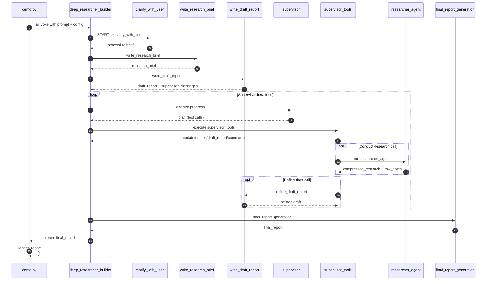

```mermaid
sequenceDiagram
    autonumber
    participant Demo as demo.py
    participant Graph as deep_researcher_builder
    participant Clarify as clarify_with_user
    participant Brief as write_research_brief
    participant Draft as write_draft_report
    participant Supervisor as supervisor
    participant SupTools as supervisor_tools
    participant Researcher as researcher_agent
    participant Final as final_report_generation

    Demo->>Graph: ainvoke with prompt + config
    Graph->>Clarify: START -> clarify_with_user
    Clarify-->>Graph: proceed to brief
    Graph->>Brief: write_research_brief
    Brief-->>Graph: research_brief
    Graph->>Draft: write_draft_report
    Draft-->>Graph: draft_report + supervisor_messages
    loop Supervisor iterations
        Graph->>Supervisor: analyze progress
        Supervisor-->>Graph: plan (tool calls)
        Graph->>SupTools: execute supervisor_tools
        SupTools-->>Graph: updated notes/draft_report/commands
        opt ConductResearch call
            SupTools->>Researcher: run researcher_agent
            Researcher-->>SupTools: compressed_research + raw_notes
        end
        opt Refine draft call
            SupTools->>Draft: refine_draft_report
            Draft-->>SupTools: refined draft
        end
    end
    Graph->>Final: final_report_generation
    Final-->>Graph: final_report
    Graph-->>Demo: return final_report
    Demo-->>Demo: render_report
```
